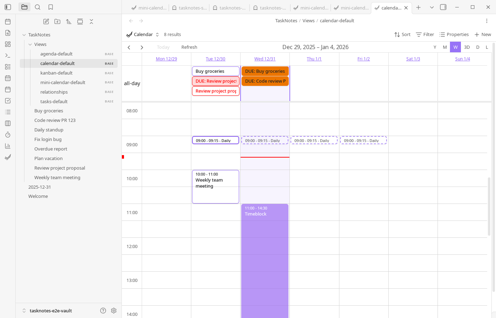
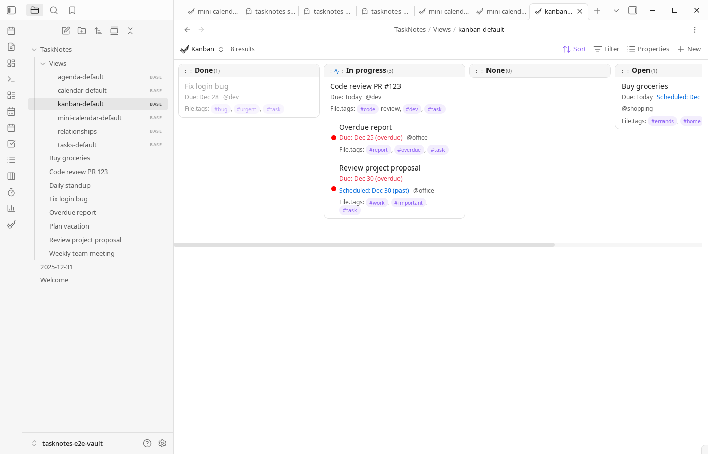
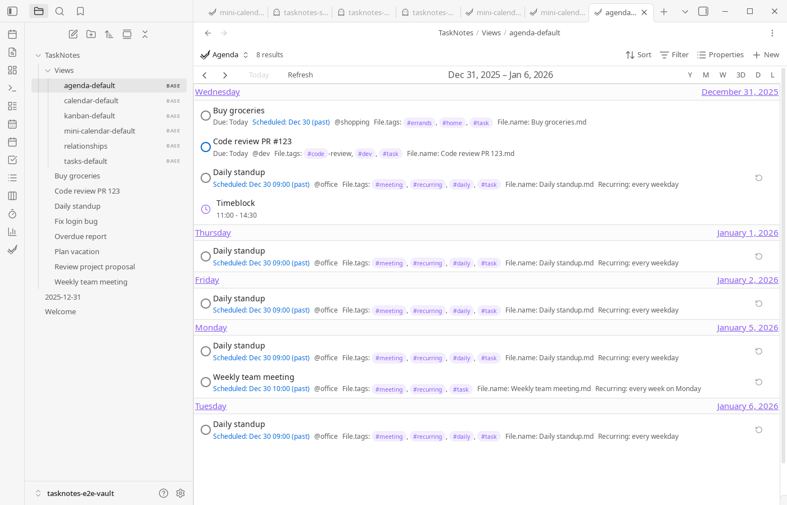
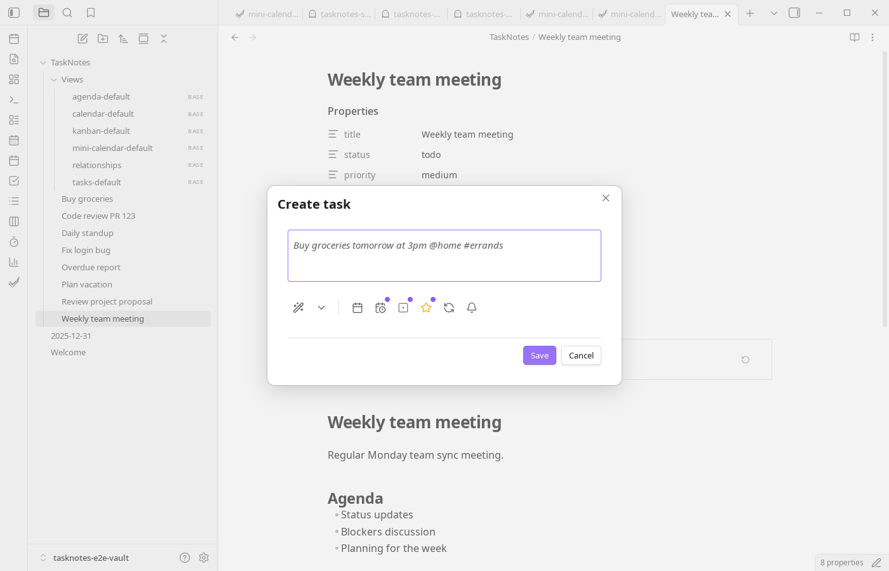
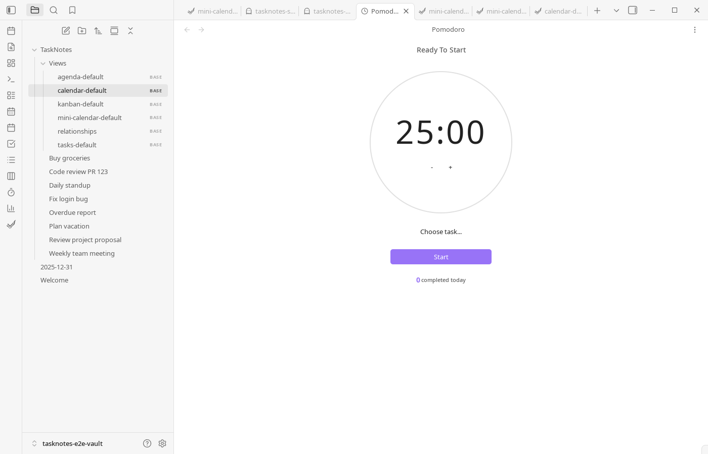
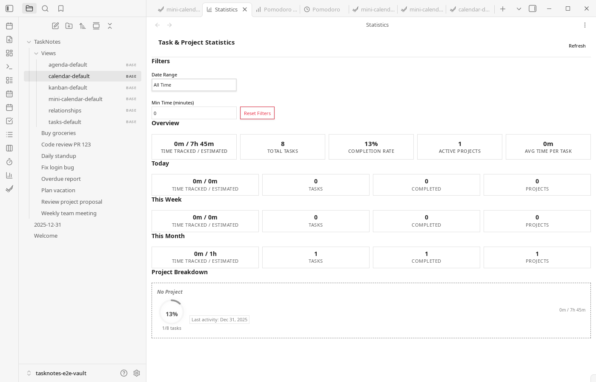

#  TaskNotes for Obsidian

A task management plugin where each task is a separate Markdown note, and all views are powered by [Obsidian Bases](https://help.obsidian.md/bases).


## Overview

Each task is a Markdown note with YAML frontmatter. Every view is a [Bases](https://help.obsidian.md/bases) query.

Bases is Obsidian's core plugin for turning notes into databases—it reads properties from your notes and lets you filter, sort, and group them without writing code. TaskNotes stores tasks as notes with structured frontmatter, then uses Bases to query and display them. The Task List, Kanban, Calendar, and Agenda views are all `.base` files.

This keeps your data portable. Tasks are just Markdown files with YAML, so you can read them with any tool, transform them with scripts, or migrate them elsewhere. There's no plugin-specific database.

The frontmatter is extensible—add fields like `energy-level` or `client` and they're immediately available in Bases for filtering and grouping. The `.base` files are plain text too, so you can edit filters and sorting directly or duplicate them to create new views.


**[Full Documentation](https://callumalpass.github.io/tasknotes/)**

## Quick start

Create a task with **TaskNotes: Create new task**. The plugin parses natural language—type "Buy groceries tomorrow #errands" and it extracts the due date and context automatically.

Tasks are stored as Markdown files in your vault. Open them directly, edit the frontmatter, or use the plugin's views to manage them.

Open a view with commands like **TaskNotes: Open tasks view** or **TaskNotes: Open kanban board**. These open the corresponding `.base` files from `TaskNotes/Views/`.

## How it works with Bases

TaskNotes registers as a Bases data source and provides custom view types: `tasknotesTaskList`, `tasknotesKanban`, `tasknotesCalendar`, `tasknotesAgenda`, and `tasknotesMinicalendar`. Your task notes become rows; frontmatter properties become columns.

The default `.base` files include formula properties for computed values:

```yaml
formulas:
  daysUntilDue: if(due, ((number(date(due)) - number(today())) / 86400000).floor(), null)
  isOverdue: due && date(due) < today() && status != "done"
  urgencyScore: formula.priorityWeight + max(0, 10 - formula.daysUntilNext)
  efficiencyRatio: (timeTracked / timeEstimate * 100).round()
```

You can sort by `urgencyScore`, filter to show only `isOverdue` tasks, or add these as columns. Edit the `.base` files directly or use the Bases UI. See [default base templates](./docs/views/default-base-templates.md) for the full list of included formulas.

## Task structure

```yaml
title: "Complete documentation"
status: "in-progress"
due: "2024-01-20"
priority: "high"
contexts: ["work"]
projects: ["[[Website Redesign]]"]
timeEstimate: 120
timeEntries:
  - startTime: "2024-01-15T10:30:00Z"
    endTime: "2024-01-15T11:15:00Z"
```

Recurring tasks use RRULE format with per-instance completion tracking:

```yaml
title: "Weekly meeting"
recurrence: "FREQ=WEEKLY;BYDAY=MO"
complete_instances: ["2024-01-08"]
```

All property names are configurable. If you already use `deadline` instead of `due`, remap it in settings.

## Other features

Calendar sync with Google and Microsoft (OAuth) or any ICS feed. Time tracking with start/stop per task, Pomodoro timer, and session history. Recurring tasks with fixed or flexible schedules and per-instance completion tracking. Dependencies between tasks. Natural language parsing for task creation. Custom statuses, priorities, and user-defined fields.

## Integrations

TaskNotes has an optional HTTP API. There's a [browser extension](https://github.com/callumalpass/tasknotes-browser-extension) and a [CLI](https://github.com/callumalpass/tasknotes-cli). Webhooks can notify external services on task changes. See [HTTP API docs](./docs/HTTP_API.md) and [Webhooks docs](./docs/webhooks.md).

## Language support

UI: English, German, Spanish, French, Japanese, Russian, Chinese, Portuguese, Korean.

Natural language parsing: English, German, Spanish, French, Italian, Japanese, Dutch, Portuguese, Russian, Swedish, Ukrainian, Chinese.

## Screenshots

<details>
<summary>View screenshots</summary>

### Calendar





### Task views







### Features








</details>

## Credits

Calendar components by [FullCalendar.io](https://fullcalendar.io/).

## License

MIT—see [LICENSE](LICENSE).
